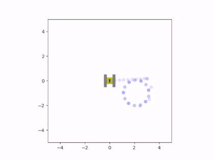

# Tracked Vehicle Simulation :tractor: :chart_with_upwards_trend:
This is a simple 2D simulation of a tracked vehicle composed of two rectangular tracks attached to a central plate. It is written in __Python 3__.

## What it simulates
The position of the vehicle is estimated using a physical model of the vehicle, an accelerometer that is integrated twice, a gyroscope for heading, and the displacement measured by two optical flow sensors. All of this data is fused to obtain the net displacement relative to an initial position using rectangular coordinates. These position and orientation estimates are used to guide the vehicle to a specified location using two PID loops, one for displacement and one for heading.  

The coordinates are stored in a buffer that can be filled via a Bluetooth module. Coordinates can be pushed or popped off the buffer. Once the vehicle is within a given radius of a coordinate, the following coordinate is made to the target destination. This process will continue indefinitely and the vehicle will follow a closed path with the coordinates as the vertices. 

## Animation
The position and orientation data is used to move a simple canvas animation which is displayed at the end of the program. This animation can then be saved as a video that is created next to the .py file. 

## Dependencies
The script requires the following libraries:

- [Numpy](https://numpy.org/)
- [Matplotlib](https://matplotlib.org/)

## Output
Here are some examples of the script's output:

   

