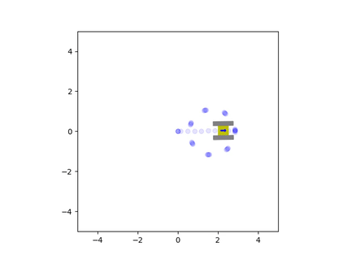

# TrackVehicleSimulation
This is a simple 2D simulation of a tracked vehicle composed of two rectangular tracks attached to a central plate. __Note:__ t is written in __Python 3__.

By track we refer to a continous belt that is in contact with the ground (also known as a tank tread). As it is in contact with the ground over a large area and not concentrated at a single point, the contact area is subdivided into a grid of contact elements. The friction force acting on these elements is then numerically integrated using simpson's rule, and these results are used as estimates for the net force and torque acting on the track. These forces are then combined under the assumption that the vehicle is a rigid body to generate the net forces acting on the vehicle.

The net vehicle force and torque are then integrated twice using the trapezoidal rule to find its instantaneous velocity and position. These velocity estimates are fed back into the track force routine to calculate a new iteration of velocity and position estimates - Esenstially, a system of ordinary differential equations is solved simultaneously in order to find the state of the vehicle.

Finally, the position and orientation data is used to move a simple canvas animation which is displayed at the end of the program. This animation can then be saved as a video that is created next to the .py file. 

Here are some examples of the script's output:

  
